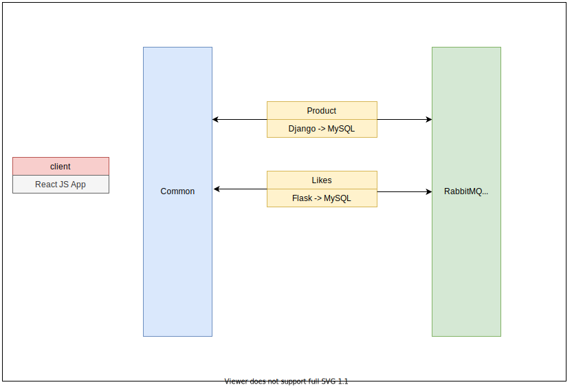
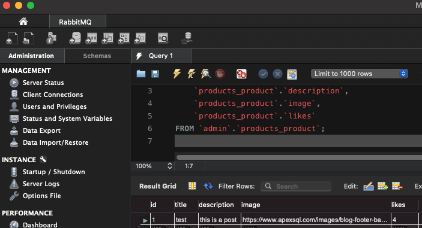
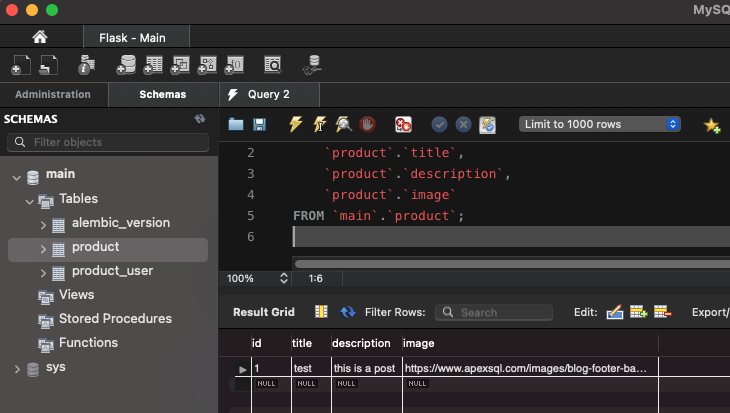
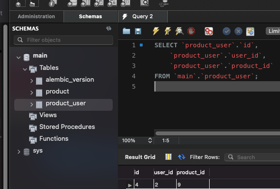

# Event-Driven Architecture (RabbitMQ)

## Architecture

The principle of a microservice is it has to be independent from other services. In a nutshell:

- Highly maintainable and testable. Either with Postman or Jest/Pytest
- Loosely coupled
- Independently deployable (Has it own database that contain all the information) 
- Organized around business capabilities
- Owned by a small team

Previously companies were using "Monolithic architecture" and microservices started to be popular in the early 2000s.

## Flow & Events

Below is the breakdown of events under each service.

- Products Service: Use by the front end to aggregate the product informations
    - Events:
        - product_created
        - product_updated
        - product_deleted

- Likes Service: Use by the front end to aggregate likes and increment
    - Event:
        - product_liked

- Frontend: Connect to both backend 8000 & 8005

In a nut shell, the service likes will connect to the products and fetch all the information and increment the likes by +1.

A limitation for these two service is it take a random user id since there is no session and aggregate it with the product id in the table product_user of the Flask application (likes service)

## Setup Environment

> python3 -m venv env

> source env/bin/activate

> cd products && docker-compose up 

> cd products && docker-compose up --build

> pip install -r requirements.txt

> cd products && python manage.py runserver

These commands will be used to run the service without Docker.

### Main

#### Activate Shell

> cd likes OR cd products

> docker-compose exec backend sh

backend is the service written in the .yml

##### Migration

> python manager.py db --help

### RabbitMQ test

> cd likes && docker-compose exec likes_backend sh

> cd products && docker-compose exec products_backend sh

> python consumer.py

### Referencies

#### Service
- https://www-freecodecamp-org.cdn.ampproject.org/v/s/www.freecodecamp.org/news/python-microservices-course/amp/?amp_js_v=a6&amp_gsa=1&usqp=mq331AQFKAGwASA%3D#csi=0&referrer=https%3A%2F%2Fwww.google.com&amp_tf=Fonte%3A%20%251%24s&ampshare=https%3A%2F%2Fwww.freecodecamp.org%2Fnews%2Fpython-microservices-course%2F

- https://youtu.be/0iB5IPoTDts

#### IBM Introduction

- https://www.youtube.com/watch?v=7rkeORD4jSw

#### AWS Support 

https://aws.amazon.com/about-aws/whats-new/2020/11/announcing-amazon-mq-rabbitmq/
